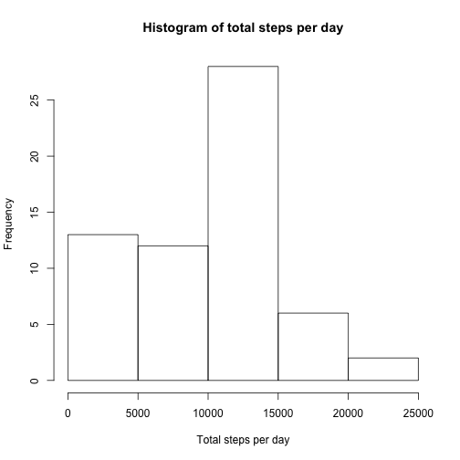
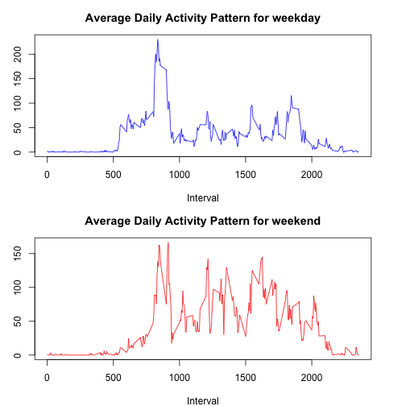

## Loading and preprocessing the data


```r
act<-read.csv('database/activity.csv')
```

## What is mean total number of steps taken per day?


```r
library(dplyr)
date_group<-group_by(act, date)
total_steps<-summarize(date_group, sum(steps,na.rm=T))
colnames(total_steps)[2]<-'total_steps'
hist(total_steps$total_steps, main="Histogram of total steps per day", xlab="Total steps per day")
```

 

```r
print(paste("Mean total steps per day is ",mean(total_steps$total_steps)))
```

```
## [1] "Mean total steps per day is  9354.22950819672"
```

```r
print(paste("Median total steps per day is ",median(total_steps$total_steps)))
```

```
## [1] "Median total steps per day is  10395"
```


## What is the average daily activity pattern?


```r
interval_group<-group_by(act, interval)
avg_interval_steps<-summarize(interval_group,mean(steps,na.rm=TRUE))
colnames(avg_interval_steps)<-c('interval', 'steps')
plot(avg_interval_steps$interval, avg_interval_steps$steps, type='l', xlab='Interval', ylab='Average Steps', main='Average Daily Activity Pattern')
```

 

```r
result<-avg_interval_steps[avg_interval_steps$steps==max(avg_interval_steps$steps,na.rm=T),]
print(paste('The max average steps ',result[2],' is at interval ',result[1]))
```

```
## [1] "The max average steps  206.169811320755  is at interval  835"
```

## Imputing missing values

We use the average steps per interval to replae the corresponding NAs in each day


```r
c<-complete.cases(act)
missing<-act[!c,]
print(paste('Number of NA rows is ',nrow(missing)))
```

```
## [1] "Number of NA rows is  2304"
```

```r
#Use the average steps per interval to replace the corresponding NAs in each day
for (i in avg_interval_steps$interval)
{
    missing[missing$interval==i,1]<-avg_interval_steps[avg_interval_steps$interval==i,2]
}

#Create a new data base act2
act2<-act
act2[!c,]<-missing
write.csv(act2,'database/activity2.csv')

date_group<-group_by(act, date)
total_steps<-summarize(date_group, sum(steps,na.rm=T))
colnames(total_steps)[2]<-'total_steps'
hist(total_steps$total_steps, main="Histogram of total steps per day", xlab="Total steps per day")
```

 

```r
mean_total_steps<-mean(total_steps$total_steps)
median_total_steps<-median(total_steps$total_steps)
print(paste("Mean total steps per day is ",mean_total_steps))
```

```
## [1] "Mean total steps per day is  9354.22950819672"
```

```r
print(paste("Median total steps per day is ",median_total_steps))
```

```
## [1] "Median total steps per day is  10395"
```

## Are there differences in activity patterns between weekdays and weekends?

```r
Sys.setlocale("LC_TIME", "C")
```

```
## [1] "C"
```

```r
act2$weekdays<-weekdays(as.Date(act2$date,format="%Y-%m-%d"))
act2$weekends<-as.factor(((act2$weekdays=='Saturday') | (act2$weekdays=='Sunday')))

act_weekends<-act2[act2$weekends==TRUE,]
act_workdays<-act2[act2$weekends==FALSE,]

#Activity patterns for workdays
par(mfrow=c(2,1),mar=c(4,3,3,3))
interval_group<-group_by(act_workdays, interval)
avg_interval_steps<-summarize(interval_group,mean(steps,na.rm=TRUE))
colnames(avg_interval_steps)<-c('interval', 'steps')
plot(avg_interval_steps$interval, avg_interval_steps$steps, type='l', xlab='Interval', ylab='Average Steps', main='Average Daily Activity Pattern for weekday',col='blue')

#Activity patterns for weekends
interval_group<-group_by(act_weekends, interval)
avg_interval_steps<-summarize(interval_group,mean(steps,na.rm=TRUE))
colnames(avg_interval_steps)<-c('interval', 'steps')
#lines(avg_interval_steps$interval, avg_interval_steps$steps,col='blue')
plot(avg_interval_steps$interval, avg_interval_steps$steps, type='l', xlab='Interval', ylab='Average Steps', main='Average Daily Activity Pattern for weekend',col='red')
```

 

